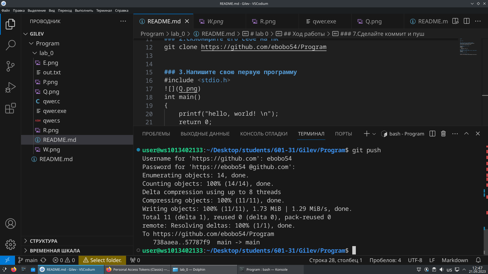

# lab 0

---

## Ход работы

---

### 1.Создайте репозиторий для дисциплины на GitHub.
ссылка на репозиторий https://github.com/ebobo54/Program
### 2.Склонирйте его себе на ПК
git clone https://github.com/ebobo54/Program

### 3.Напишите свою первую программу 
#include <stdio.h>
int main()
{
    printf("hello, world! \n");
    return 0;
}

### 4.Скомпелируйте и запустите её
### 5.Получите по отдельности результаты каждого этапа компиляции.
 
 
### 7.Сделайте коммит и пуш

 

## Список использованных источников:
[Markdown Cheat Sheet](https://www.markdownguide.org/cheat-sheet/)