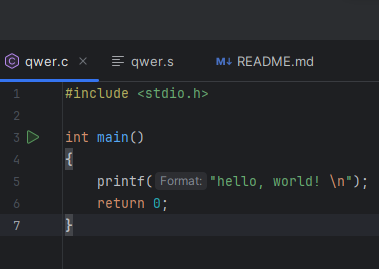
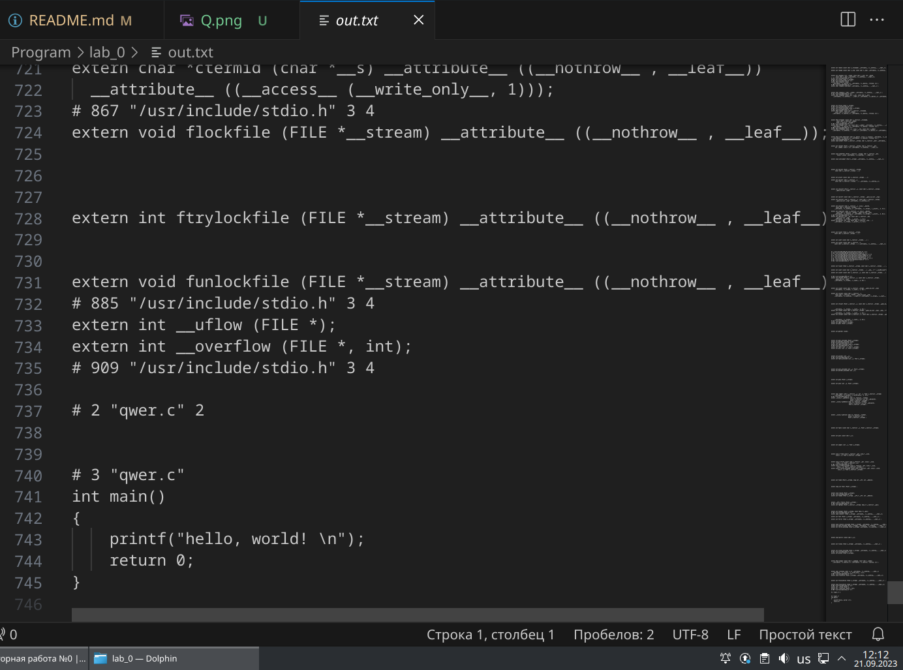

# lab 0

---

## Ход работы

---

### 1.Создайте репозиторий для дисциплины на GitHub.
ссылка на репозиторий https://github.com/ebobo54/Program
### 2.Склонирйте его себе на ПК
```
git clone https://github.com/ebobo54/Program
```

### 3.Напишите свою первую программу 
```c
#include <stdio.h>
int main()
{
    printf("hello, world! \n");
    return 0;
}
```

### 4.Скомпелируйте и запустите её

### 5.Получите по отдельности результаты каждого этапа компиляции.
#### Перпроцессор 
 

---

#### Компилятор
 

---

#### Объектный файл

### 7.Сделайте коммит и пуш
#### Коммит 


---

#### Пуш
 
### 8.Добавьте для себя в отчёт шпаргалку по работе с git
  
---

`git clone` - позволяет клонировань репозиторий из GitHub

---

`git add`- добавляет  изменения из рабочего катало8га в раздел проиндексированных файлов

---

`git commit`- делает снимок текущего состояния изминений

---

`git push`-позволяет отправлять локальныйю ветку на удаленный репозиторий 
## Список использованных источников:
[Markdown Cheat Sheet](https://www.markdownguide.org/cheat-sheet/)