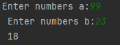

# lab_1
 
 ---

 ## Задание
Вывести сумму цифр числа a если она больше b, если равна b - сообщение Сумма цифр = b, и значение суммы, увеличенное на b, если сумма меньше b.
```c
#include <stdio.h>
int main()
{
    float a, b;
    printf("Enter a -> ");
    scanf("%f", &a);
    printf("Enter b -> ");
    scanf("%f", &b);
    if (a > b)
        printf("%f\n",a);
    if (a == b)
        printf("%f Сумма цифр =\n",b);
    if (a < b)
        printf("%f\n",a+b);
    return 0;

}
```


---

a>b


---

a=b


---

a<b


---
```mermid
flowchart TD
A[Начало] --> B{a,b}
B --> C[a>b]
C -- true --> D[print a]
C -- false --> E[a=b]
E -- true --> F[Сумма цифр = b]
E -- false --> G[a<b]
G --> H[a+b]
H --> I[Конец]
D --> I[Конец]
F --> I[Конец]
```