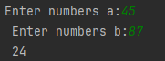

# lab_1
 
 ---

 ## Задание
Вывести сумму цифр числа a если она больше b, если равна b - сообщение Сумма цифр = b, и значение суммы, увеличенное на b, если сумма меньше b.
```c
#include <stdio.h>

int main()
{
    int amnam(int num)
    {
        int sum = 0;
        while (num != 0) {
            sum += num % 10;
            num /= 10;
        }
        return sum;
    }

    int a, b, q, w;
    printf("Enter numbers a: ");
    scanf("%d", &a);
    printf("Enter numbers b: ");
    scanf("%d", &b);
    q = amnam(a);
    w = amnam(b);
    if (q > w) {
        printf("sum numbers a > sum numbers b %d\n", q);
    } if (q == w) {
        printf("Sum numbers = b %d\n", w);
    } if (q < w){
        printf("sum numbers a < b %d\n", q + w);
    }

    return 0;
}
```

## Результаты работы

---

a>b


---

a=b


---

a<b


---

1. [Markdown Cheat Sheet](https://www.markdownguide.org/cheat-sheet/)
2. [stackoverflow](https://stackoverflow.com/questions/34836305/how-do-i-make-a-flowchart-using-markdown-on-my-github-blog)