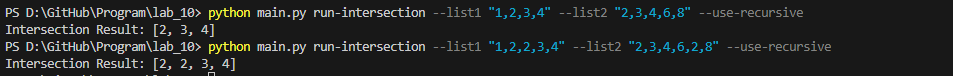
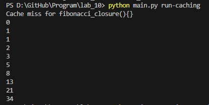
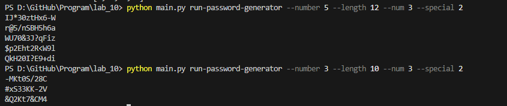

# Lab_10
## Ход работы:
   1.Создайте пакет, содержащий 3 модуля на основе лабораторных работ №№ 7-9
   2.Напишите запускающий модуль на основе Typer, который позволит выбирать и настраивать параметры запуска логики из пакета.

## Скриншоты результатов
### lab7

---

### lab8

---

### lab9

## Ссылки на используемые материалы
1. [Markdown Cheat Sheet](https://www.markdownguide.org/cheat-sheet/)
2. [Прог. Лабораторная работа №10](https://evil-teacher.on.fleek.co/prog_pm/lab10/)