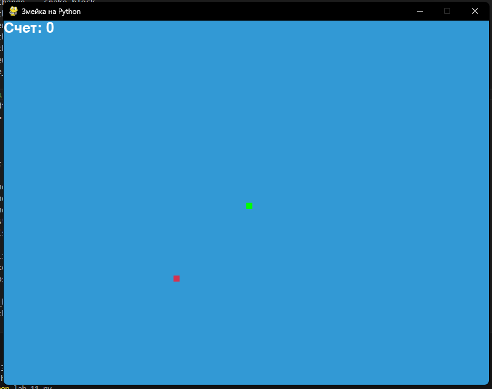

# Lab_11
## Ход работы:
   Реализуйте приложение с GUI (приложения-игры допускается делать с использованием TUI-пакетов) по своему варианту. Можно изменить задание на собственную тему, согласовав с преподавателем. Список GUI фреймворков:

appJar
Tkinter
Flet
wxPython
PySimpleGUI
Pyforms
Toga
PyGObject
guizero
guietta
PySide6
Dear PyGui
PyGame

## Варианты заданий - темы проектов
### Игра “Змейка”.

## Скриншоты результатов

## Ссылки на используемые материалы
1. [Markdown Cheat Sheet](https://www.markdownguide.org/cheat-sheet/)
2. [Прог. Лабораторная работа №11](https://evil-teacher.on.fleek.co/prog_pm/lab11/)