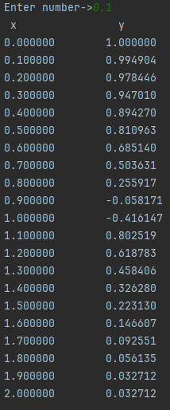

# Lab_2
## Задание

### Описание проделанной работы
#### оператор цикла while 
```c
#include <stdio.h>
#include <math.h>
#include <unistd.h>

int main()
{

    double y,s,x = 0.0;
    printf("Enter number-> ");
    scanf("%lf", &s);
    int n;
    n=2/s+1;

    while(n)
    {
        if (x >= 0 && x <= 1)
            y = cos(x + pow(x, 3.0));
        if (x > 1 && x <= 2)
            y = exp(-pow(x, 2.0) - pow(x, 2.0) + 2.0 * x);
        printf("%lf %lf\n", x, y);
        x += s;
        n = n - 1;
    }
    return 0;
}
```


---
#### оператор цикла for
```c
#include <stdio.h>
#include <math.h>

int main()
{
    double y,s,x = 0.0;
    printf("Enter number-> ");
    scanf("%lf", &s);
    int n;
    n = s / 2.0;
    printf("x\t\ty\n");
    for(x = 0.0; x <= 2.0 + n; x = x + s)
    {
        if(x >= 0 && x <= 1)
            y = cos(x + pow(x, 3.0));
        else
            y = exp(-pow(x, 2.0) - pow(x, 2.0) + 2.0 * x);
        printf("%f\t%f\n", x, y);
    }
    return 0;
}
``````


---
### Результат

___
### График функции

---
### Блок-схема


---

1. [Markdown Cheat Sheet](https://www.markdownguide.org/cheat-sheet/)
2. [Блок-схемы](https://app.diagrams.net/?src=about)
