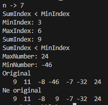
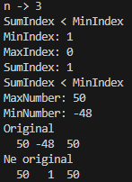
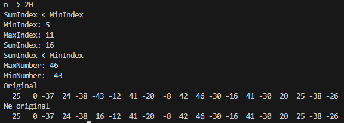

# Lab_3
Сложность:
  Rare
  1. Задание 
  2. Описание проделанной работы
  3. Скриншоты результаты
  4. Ссылки на используемые материалы
## 1. Задание 
Найти сумму индексов максимального и минимального элемента массива, если она меньше/больше по модулю минимума/максимума соответственно, записать её на их место, иначе обнулить массив между минимум и максимумом.
## 2. Описание проделанной работы
```c
#include <stdio.h>
#include <stdlib.h>
#include <time.h>

void fill(int n, int a[]) {
    int i;
    for (i = 0; i < n; i++)
        a[i] = rand() % 101 - 50;
}

int findMinIndex(int n, int a[]) {
    int minIndex = 0;
    for (int i = 1; i < n; i++) {
        if (a[i] < a[minIndex])
            minIndex = i;
    }
    return minIndex;
}

int findMaxIndex(int n, int a[]) {
    int maxIndex = 0;
    for (int i = 1; i < n; i++) {
        if (a[i] > a[maxIndex])
            maxIndex = i;
    }
    return maxIndex;
}

void process(int n, int a[]) {
    int minIndex = findMinIndex(n, a);
    int maxIndex = findMaxIndex(n, a);

    int sumIndex = minIndex + maxIndex;

    if (abs(sumIndex) < abs(a[minIndex])) {
        a[minIndex] = sumIndex;
    } else if (abs(sumIndex) > abs(a[maxIndex])) {
        a[maxIndex] = sumIndex;
    } else {
        int start = (minIndex < maxIndex) ? minIndex : maxIndex;
        int end = (minIndex > maxIndex) ? minIndex : maxIndex;

        for (int i = start + 1; i < end; i++) {
            a[i] = 0;
        }
    }
}

int main() {
    
    srand(time(NULL));
    int n, a, i, w, q;
    printf("n -> ");
    scanf("%d", &n);
    int A[n];
    fill(n, A);

    int minIndex = findMinIndex(n, A);
    int maxIndex = findMaxIndex(n, A);

    int sumIndex = minIndex + maxIndex;

    if (abs(sumIndex) < abs(A[minIndex])) {
        printf("SumIndex < MinIndex \n");
    }else if(abs(sumIndex) > abs(A[maxIndex])){
        printf("SumIndex > MaxIndex \n");
    }else printf("SumIndex = MaxIndex\n" ,000);


    printf("MinIndex: %d\n", minIndex);

    printf("MaxIndex: %d\n", maxIndex);

    printf("SumIndex: %d\n", sumIndex);
     
     if (abs(sumIndex) < abs(A[minIndex])) {
        printf("SumIndex < MinIndex \n");
    }else if(abs(sumIndex) > abs(A[maxIndex])){
        printf("SumIndex > MaxIndex \n");
    }else printf("SumIndex = MaxIndex\n" ,000);

    int MaxNumber = A[maxIndex];
    printf("MaxNumber: %d\n", MaxNumber);

    int MinNumber = A[minIndex];
    printf("MinNumber: %d\n", MinNumber);
    
    printf("Original\n");
    for (int i = 0; i < n; i++)
        printf("%4d", A[i]);
    printf("\n");

    process(n, A);

    printf("Ne original\n");
    for (int i = 0; i < n; i++)
        printf("%4d", A[i]);
    printf("\n");

    return 0;
}
```
---
### Заполнение массива случайными числами
```c
void fill(int n, int a[]) {
    int i;
    for (i = 0; i < n; i++)
        a[i] = rand() % 101 - 50;
}
``` 
---
### Поиск индекса минимального элемента
```c
int findMinIndex(int n, int a[]) {
    int minIndex = 0;
    for (int i = 1; i < n; i++) {
        if (a[i] < a[minIndex])
            minIndex = i;
    }
    return minIndex;
}

```
---
### Поиск индекса максимального элемента
```c
int findMaxIndex(int n, int a[]) {
    int maxIndex = 0;
    for (int i = 1; i < n; i++) {
        if (a[i] < a[maxIndex])
            maxIndex = i;
    }
    return maxIndex;
}

```
### Вычисляет сумму индексов минимального и максимального элементов
```c
void process(int n, int a[]) {
    int minIndex = findMinIndex(n, a);
    int maxIndex = findMaxIndex(n, a);

    int sumIndices = minIndex + maxIndex;

    if (abs(sumIndices) < abs(a[minIndex])) {
        a[minIndex] = sumIndices;
    } else if (abs(sumIndices) > abs(a[maxIndex])) {
        a[maxIndex] = sumIndices;
    } else {
        int start = (minIndex < maxIndex) ? minIndex : maxIndex;
        int end = (minIndex > maxIndex) ? minIndex : maxIndex;

        for (int i = start + 1; i < end; i++) {
            a[i] = 0;
        }
    }
}
```
## 3. Скриншоты результатов




---
## 4. Ссылки на используемые материалы
1. [Markdown Cheat Sheet](https://www.markdownguide.org/cheat-sheet/)
2. [Прог. Лабораторная работа №3](https://evil-teacher.on.fleek.co/prog_pm/lab03/)
