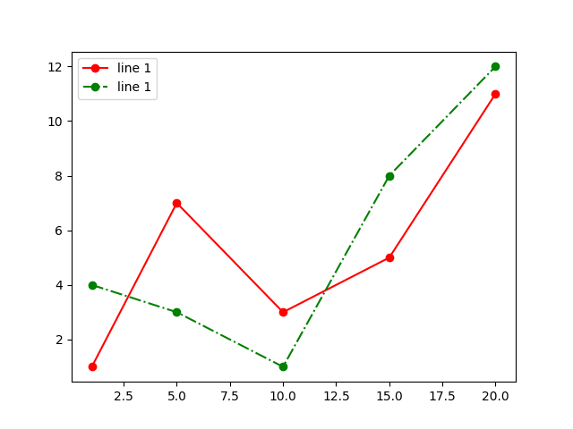
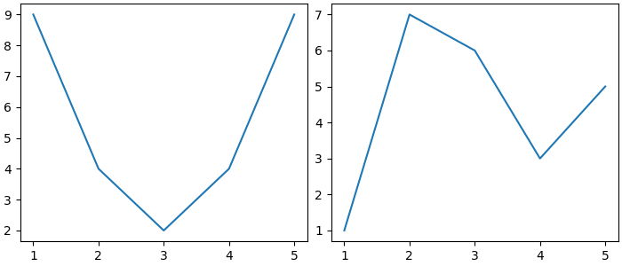
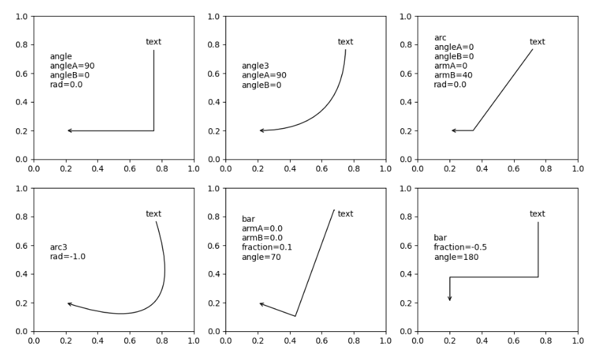
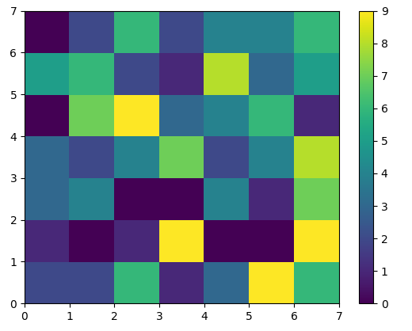

# lab_5
## Задание 

1. Создайте в каталоге для данной ЛР в своём репозитории виртуальное окружение и установите в него matplotlib и numpy. Создайте файл requirements.txt.
2. Откройте книгу [1] и выполните уроки 1-3. Первый урок можно начинать со стр. 8.
3. Выберите одну из неразрывных функции своего варианта из лабораторной работы №2, постройте график этой функции и касательную к ней. Добавьте на график заголовок, подписи осей, легенду, сетку, а также аннотацию к точке касания.
4. Добавьте в корень своего репозитория файл .gitignore отсюда, перед тем как делать очередной коммит.
5. Оформите отчёт в README.md. Отчёт должен содержать:

- графики, построенные во время выполнения уроков из книги
- объяснения процесса решения и график по заданию 4

6. Склонируйте этот репозиторий НЕ в ваш репозиторий, а рядом. Изучите использование этого инструмента и создайте pdf-версию своего отчёта из README.md. Добавьте её в репозиторий.

### 2. Откройте книгу [1] и выполните уроки 1-3. Первый урок можно начинать со стр. 8.
## Скриншоты результатов
# 1

# 2

# 3

# 4

# 5

# 6

# 7

# 8

# 9

# 2

# 2

# 10

# 11

# 12

# 13

# 14

# 15

# 16

# 17

# 18

# 19

# 20

# 21

# 22

# 23

# 24

# 25

# 26

# 27

# 28

# 29

# 30

# 31

# 32

# 33

# 34

# 35

# 36

# 37

# 38

### 3. Выберите одну из неразрывных функции своего варианта из лабораторной работы №2, постройте график этой функции и касательную к ней. Добавьте на график заголовок, подписи осей, легенду, сетку, а также аннотацию к точке касания.
 
#### Вариант 4.
$$ f(n) =
 \begin{cases}
 pow(8x,3)cosx - \sqrt{x} - \frac{1}{2}, & \quad 0 \leq x \leq 1; \\
e^{-x-\frac{1}{x}}, & \quad 1 < x \leq 2.
\end{cases}
$$

## Ссылки на используемые материалы
1. [Markdown Cheat Sheet](https://www.markdownguide.org/cheat-sheet/)
2. [Прог. Лабораторная работа №5](https://evil-teacher.on.fleek.co/prog_pm/lab05/)