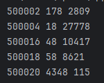
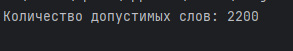

# lab_6
## Условие задачи 
1.Ученица составляет 5-буквенные слова из букв ГЕПАРД. При этом в каждом слове ровно одна буква Г, слово не может начинаться на букву А и заканчиваться буквой Е. Какое количество слов может составить ученица?

2.Значение выражения 5^36 +5^24−25 записали в системе счисления с основанием 5. Сколько цифр 4 содержится в этой записи?

3.Найдите 5 чисел больших 500000, таких, что среди их делителей есть число, оканчивающееся на 8, при этом этот делитель не равен 8 и самому числу. В качестве ответа приведите 5 наименьших чисел, соответствующих условию.

Формат вывода: для каждого из 5 таких найденных чисел в отдельной строке сначала выводится само число, затем минимальный делитель, оканчивающийся на 8, не равный 8 и самому числу.

## Скриншоты результатов
1.

2. 

3. 

## Ссылки на используемые материалы
1. [Markdown Cheat Sheet](https://www.markdownguide.org/cheat-sheet/)
2. [Прог. Лабораторная работа №3](https://evil-teacher.on.fleek.co/prog_pm/lab03/)