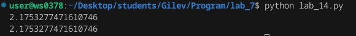

# Lab_7
## Ход работы:
1.Напишите две функции для решения задач своего варианта - с использованием рекурсии и без.     

2.Оформите отчёт в README.md. Отчёт должен содержать:

Условия задач

Описаниепроделанной работы

Скриншоты результатов

Ссылки на используемые материалы

## Условие задачи 
### Функция для нахождения пересечения двух списков.
```py
>>> intersect([1, 2, 3, 4], [2, 3, 4, 6, 8])
[2, 4]
>>> intersect([5, 8, 2], [2, 9, 1])
[2]
>>> intersect([5, 8, 2], [7, 4])
[]
```
### Функция для расчёта
$$ x(n) =\sqrt{3+\sqrt{3+\sqrt{3+\sqrt{...+\sqrt{3}}}}}
$$

## Скриншоты результатов
1.


2.


## Ссылки на используемые материалы
1. [Markdown Cheat Sheet](https://www.markdownguide.org/cheat-sheet/)
2. [Прог. Лабораторная работа №3](https://evil-teacher.on.fleek.co/prog_pm/lab07/)