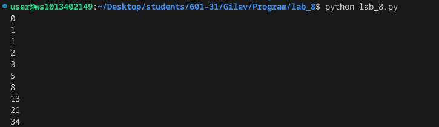
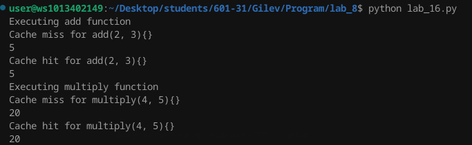
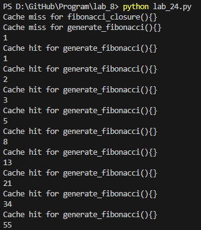

# Lab_8
## Ход работы:
    1.Решите обе задачи своего варианта.
    2.Примените декоратор к замыканию.
    3.Оформите отчёт в README.md. Отчёт должен содержать:
        Условия задач
        Описание проделанной работы
        Скриншоты результатов
        Ссылки на используемые материалы

## Условие задачи 
    Замыкание реализующее последовательность Фибоначчи.
    Декоратор для кэширования результатов выполнения функций.

## Скриншоты результатов
1.

2.

3.

## Ссылки на используемые материалы
1. [Markdown Cheat Sheet](https://www.markdownguide.org/cheat-sheet/)
2. [Прог. Лабораторная работа №3](https://evil-teacher.on.fleek.co/prog_pm/lab08/)